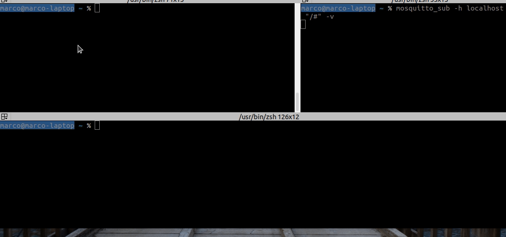
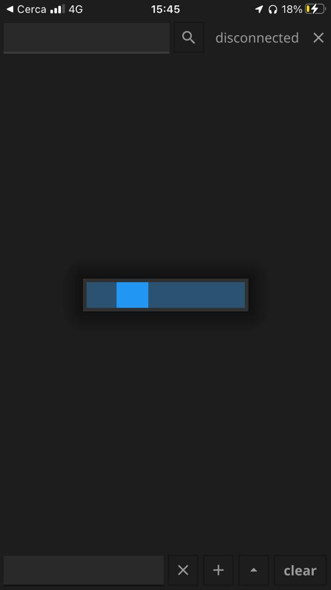

# mqtt-shell


mqtt-shell is a go tool to connect to a remote shell via mqtt. It includes:

 - mqtt-shell server ( go daemon for the remote host )
 - mqtt-shell client ( go tool to connect to a server )
 - mqtt-shell beacon discovery ( go tool to find all mqtt-shell severs connected to the broker )

It also includes a gui that implement client and beacon discovery features.
Gui is available for linux windows mac and also for mobile ios and android




### Installation
Install the dependencies and build [ linux windows and android ]
```sh
$ go get
$ ./compile.sh
```
Install the dependencies and build [ ios ]
```sh
$ go get
$ cd cmd/mqtt-shell-gui
$ fyne package -os ios -appID com.mqtt.shell -icon ../../assets/mqtt-shell.png -name mqtt-shell
```

### Start mqtt-shell sever
after build

```sh
$ ./mqtt-shell -b <mqttbroker> -u <user> -P <password>  -p <mqttbrokerport> -m server -i <id>
```

or

```sh
$ ./mqtt-shell -c <conf.toml>


[CLI]
Broker=<mqttbroker>
BrokerUser=<user>
BrokerPassword=<password>
BrokerPort=<mqttbrokerport>
Mode="server"
Id=<id>
```

### Start mqtt-shell client (command line)
after build

```sh
$ ./mqtt-shell -b <mqttbroker> -u <user> -P <password>  -p <mqttbrokerport> -m client -i <serverid>
```

### Start mqtt-shell client (gui)
after build

```sh
$ ./mqtt-shell -m gui 
```

### Start mqtt-shell beacon discovery
after build

```sh
$ ./mqtt-shell -b <mqttbroker> -u <user> -P <password>  -p <mqttbrokerport> -m beacon
```

beacon discovery response

```sh
Ip:      10.0.49.51 - Id:      mqtt-shell-test - Version:       0.0.4 - Time: 2022-04-14 08:13:52.677526253 +0200 CEST 
Ip: 192.168.251.210 - Id:  mqtt-shell-server-1 - Version:       0.0.3 - Time: 2022-04-14 06:13:52.669033242 +0000 UTC 
Ip:    218.16.79.73 - Id:  mqtt-shell-server-2 - Version:       0.0.3 - Time: 2022-04-14 08:13:52.677131422 +0200 CEST 
```
